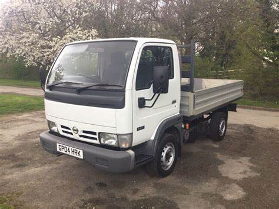

`
If player has backstory, use that and spin some sad or stupid death.

* Do not read the DM parts out loud.
`

## P1
### E1
`Insert Players here` has lived a long and fulfilling life on Earth. Long and fulfilling are subjective terms. However, their death was a tragic one,
especially when they were struck by a small Nissan1 flatbed going 25 MPH.

The player expects their death, but low and behold, they are provided a 1 time ticket to be isekai'd (lit. in another world). Of course, they're
not going to go empty handed.

#### DM
* Use Starting Items table and provide to player
* Player gets basic necessities such as clothes
* Player does not get any gold

### E2
Once the player(s) get their starting items, they will enter battle with `Insert Low Level creature`

#### DM
* This is to hopefully make the player overconfident, if not, replay this part up to 3x
* In order to replay and apply smoothly until next, say that the player(s) see another figure of this creature up ahead

### Appendix
* 1 : Nissan is a registered trademark of Nissan Motor Co. Ltd.

## P2
Now that you get closer towards the `Insert Low Level creature`, it seems that it was all but that. In front of you begins to look like something that may tower over you. 

Do you approach the creature?

* Approach:
    * As you approach the creature, you begin to see that it is a `Insert Color` Dragon. 
* Flee:
    * As you flee the creature, the creature takes notice and flies after you. It blocks your path of retreat.

#### DM
* This is a dragon misinterpreted as the previous `Insert Low Level creature`
* Depending on character action after approaching dragon, it will do different things.
    * Approach:
        * All player initiatives are above the creature
        * All player  
    * Flee:
        * All player initiative are below the creature
        * Something something damage
* Players are not expected to defeat this creature. On low player health, do not target them. Once all players are relatively low, pull the best plot armor.

## P3
In-town gold getting

## P4
Shield Hero - Bitch